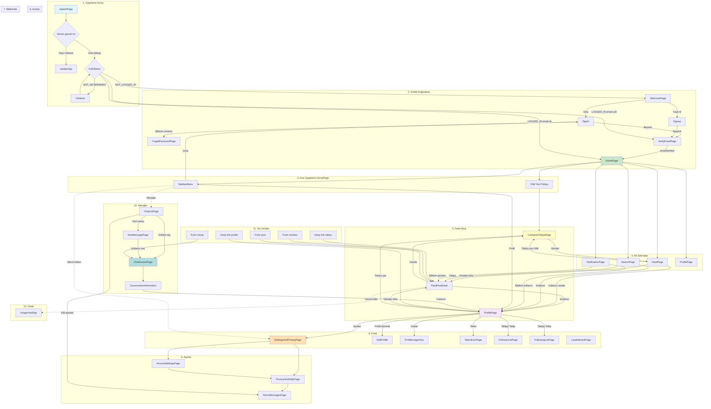

# Toldya — End-to-End Kullanıcı Akışı

Bu doküman, Toldya uygulamasındaki baştan sona kullanıcı akışlarını (ekranlar, geçişler ve koşullar) özetler.

---

## End-to-End Akış Diyagramı (Tüm Akışlar Birleşik)

Aşağıdaki diyagram uygulama açılışından ana ekranlara, mesajlaşmaya, profile ve ayarlara kadar tüm akışları tek çatıda gösterir. Mermaid destekleyen ortamlarda (GitHub, GitLab, VS Code eklentileri, vb.) otomatik çizilir.



**Diyagram özeti:**
- **Mavi**: Başlangıç (Splash).
- **Yeşil**: Ana sayfa (HomePage).
- **Sarı**: Gönderi yazma (Compose).
- **Mor**: Profil ve profil ile ilgili ekranlar.
- **Turuncu**: Ayarlar.
- **Teal**: Mesajlaşma.
- Kesikli ok: Görsel tam ekran gibi yardımcı geçiş.

---

## 1. Uygulama Açılışı (Cold Start)

```
[SplashPage] (initialRoute)
     │
     ├─► Sürüm kontrolü (Firebase Remote Config: appVersion)
     │        │
     │        ├─ Güncel değil + release build → [UpdateApp] (güncelleme zorunlu)
     │        └─ Güncel / debug → devam
     │
     ├─► AuthState.getCurrentUser() → AuthStatus belirlenir
     │
     └─► AuthStatus’a göre yönlendirme:
              NOT_DETERMINED  → yükleme (loader), sonra tekrar değerlendirme
              NOT_LOGGED_IN   → [WelcomePage]
              LOGGED_IN       → emailVerified?
                                    true  → [HomePage]
                                    false → [VerifyEmailPage]
```

- **Deep link**: Uygulama açılışında veya arka planda `Firebase Dynamic Links` dinlenir.
  - `.../profile/{id}` → `/ProfilePage/{id}`
  - `.../toldya/{id}` → post detay yüklenir → `/FeedPostDetail/{id}`

---

## 2. Kimlik Doğrulama Akışı

### 2.1 Giriş yapmamış kullanıcı

```
[WelcomePage]
     │
     ├─► "Giriş" → [SignIn] (loginCallback: getCurrentUser)
     │                 │
     │                 ├─ "Şifremi unuttum" → [ForgetPasswordPage]
     │                 └─ Başarılı giriş → pop + callback → Splash yeniden değerlendirir
     │                       → emailVerified? HomePage : VerifyEmailPage
     │
     └─► "Kayıt ol" → [Signup] (loginCallback: getCurrentUser)
                          └─ Başarılı kayıt → pop + callback → aynı mantık
```

### 2.2 E-posta doğrulama

```
[VerifyEmailPage]
     │
     └─► Kullanıcı e-postayı doğrulayıp "Devam" → state.getCurrentUser()
             → emailVerified true ise → [HomePage]
```

### 2.3 Oturum açıkken sidebar’dan çıkış

```
[SidebarMenu] → "Giriş yap" (veya çıkış) → [SignIn]
```

---

## 3. Ana Uygulama (Giriş yapmış kullanıcı)

### 3.1 Ana iskelet

```
[HomePage]
     │
     ├─► Alt sekmeler (BottomMenubar): pageIndex
     │       0 → [FeedPage]
     │       1 → [SearchPage]
     │       2 → [NotificationPage]
     │       3 → [ProfilePage]
     │
     ├─► FAB (ortada, bolt ikonu) → /CreateFeedPage/toldya → [ComposeToldyaPage] (yeni toldya)
     │
     ├─► Drawer → [SidebarMenu]
     └─► Push bildirimi (foreground):
              Message    → [ChatScreenPage] (ilgili kullanıcı set edilir)
              Mention    → [FeedPostDetail/{toldyaId}]
```

### 3.2 Feed (Ana akış)

```
[FeedPage]
     │
     ├─► App bar: Arama → [SearchPage], Bildirimler → [NotificationPage], Profil → [ProfilePage]
     ├─► FAB / “Toldya yaz” → [ComposeToldyaPage] (CreateFeedPage/toldya)
     ├─► Bir gönderiye tıklama → [FeedPostDetail/{postId}]
     └─► Gönderi kartı: kullanıcı adı/avatar → [ProfilePage/{userId}]
```

### 3.3 Gönderi detayı

```
[FeedPostDetail]
     │
     ├─► "Yanıtla" (cevapla) → [ComposeToldyaPage] (toldya + postId)
     ├─► Üst/alt gönderi veya kullanıcı tıklama → [ProfilePage/{userId}]
     └─► Geri → Feed / önceki ekran
```

### 3.4 Gönderi girme akışı (sadece bu kısım)

Gönderi (Toldya) yazma ekranı **ComposeToldyaPage** ile yapılır. Üç tür gönderi vardır: **yeni toldya**, **retoldya** ve **yanıt (yorum)**. Akış aşağıda adım adım özetleniyor.

#### Nereden açılır?

| Nereden | Route | Tür |
|--------|--------|-----|
| Ana sayfa FAB (ortadaki bolt) | `/CreateFeedPage/toldya` | Yeni toldya |
| Feed sayfası “Toldya yaz” / FAB | `/CreateFeedPage/toldya` | Yeni toldya |
| Profil sayfası “Toldya yaz” | `/CreateFeedPage` | Yeni toldya |
| Gönderi detayı “Yanıtla” FAB | `/ComposeToldyaPage/toldya/{postId}` | Yanıt (yorum) |

Retoldya için route: `/ComposeToldyaPage/retoldya` (uygulama içinde bu route’a nereden gidildiği ayrı bir inceleme konusu).

#### Route’a göre sayfa parametreleri

- **CreateFeedPage** → `ComposeToldyaPage(isRetoldya: false, isToldya: true)` → sadece yeni gönderi.
- **ComposeToldyaPage**:
  - `/ComposeToldyaPage/retoldya` → `isRetoldya: true`, `isToldya: false` (retoldya).
  - `/ComposeToldyaPage/toldya` (3 segment) → yeni toldya.
  - `/ComposeToldyaPage/toldya/{postId}` (4 segment) → `isToldya: false` → yanıt; yanıtlanan gönderi `FeedState.toldyaToReplyModel` ile gelir.

Yanıt için **FeedPostDetail** ekranında “Yanıtla” (FAB) basıldığında önce `state.setToldyaToReply = model` ile mevcut gönderi set edilir, sonra `/ComposeToldyaPage/toldya/$postId` ile compose açılır. Compose sayfası `initState`’te `feedState.toldyaToReplyModel` ile bu modeli okur (yoksa boş bir `FeedModel`).

#### Compose ekranında kullanıcı ne yapar?

1. **Metin**  
   - Tek satırlık metin alanına gönderi metnini yazar.  
   - **280 karakter** sınırı vardır; 260+ olunca sayaç turuncu, 280’de kırmızı olur.  
   - **@kullaniciadi** yazınca `ComposeToldyaState` ve `SearchState` ile kullanıcı listesi açılır; kullanıcı seçilince etiket metne eklenir.

2. **Görsel (isteğe bağlı)**  
   - Alt bardaki **galeri** veya **kamera** ikonu ile tek görsel seçilir.  
   - Seçilen dosya `ComposeTweetImage` ile önizlenir; çarpı ile kaldırılabilir.

3. **Gönder**  
   - Gönder butonu, metin **boş değilse** ve **280 karakteri aşmıyorsa** aktif olur (`ComposeToldyaState.enableSubmitButton`).  
   - Basıldığında `_submitButton()` çalışır.

#### Gönder’e basınca ne olur?

1. **Validasyon**  
   - Metin boş, null veya 280’den uzunsa işlem yapılmaz (return).

2. **Model oluşturma**  
   - `createToldyaModel()` ile bir `FeedModel` üretilir:  
     - Kullanıcı bilgisi `AuthState.userModel`’den, metin `_textEditingController.text`’ten, `#hashtag` listesi `getHashTags(...)` ile alınır.  
     - **Yeni toldya** → `parentkey: null`, `childRetoldyaKey: null`, `statu: statusPendingAiReview`.  
     - **Yanıt** → `parentkey: toldyaToReplyModel.key`, `childRetoldyaKey: null`, topic üst gönderiden.  
     - **Retoldya** → `childRetoldyaKey: model.key`, `parentkey: null`.  
   - Kullanıcı rank’i +2 artırılıp `authState.createUser` ile güncellenir.

3. **Görsel varsa**  
   - Önce `FeedState.uploadFile(imageFile)` ile görsel Firebase Storage’a yüklenir.  
   - Dönen `imagePath` modele yazılır.  
   - Sonra türe göre: **yeni toldya** → `state.createToldya(toldyaModel)`, **retoldya** → `state.createReToldya(toldyaModel)`, **yanıt** → `state.addcommentToPost(toldyaModel)`.

4. **Görsel yoksa**  
   - Doğrudan aynı üç fonksiyondan biri çağrılır (createToldya / createReToldya / addcommentToPost).

5. **Bildirim**  
   - Metindeki @etiketler için `ComposeToldyaState.sendNotification(toldyaModel, searchState)` ile ilgili kullanıcılara bildirim gönderilir.

6. **UI sonrası**  
   - Loader kapatılır.  
   - **Yeni toldya** ise SnackBar: “Gönderiniz incelemeye alındı. Onaylandığında akışta görünecektir.”  
   - `Navigator.pop(context)` ile compose kapanır, kullanıcı bir önceki ekrana (feed, profil veya gönderi detayı) döner.

#### Özet akış (gönderi girme)

```
[Feed / Profil / FeedPostDetail]
        │
        │  FAB veya "Toldya yaz" / "Yanıtla"
        ▼
[ComposeToldyaPage]
        │  Metin (max 280) + isteğe bağlı görsel, @etiket → kullanıcı listesi
        │  Gönder butonu: metin dolu ve ≤280 ise aktif
        ▼
  _submitButton()
        │  createToldyaModel() → FeedModel
        │  Görsel varsa: uploadFile → sonra createToldya / createReToldya / addcommentToPost
        │  Görsel yoksa: doğrudan aynı create/comment
        │  sendNotification (@etiketler)
        ▼
  SnackBar (yeni toldya) + Navigator.pop → önceki ekran
```

Bu akış **sadece gönderi girme** kısmını anlatır; feed’in yüklenmesi, onay süreci veya detay sayfası ayrı akışlardır.

#### Gerçek akış: Fikir → AI incelemesi → İddia tarihi → Yayın

Kullanıcının tarif ettiği akış **kod ve mimari ile uyumludur**:

1. **Kullanıcı fikrini yazar**  
   Compose ekranında metni (ve isteğe bağlı görseli) girip Gönder’e basar. Gönderi veritabanına **hemen yayınlanmadan** kaydedilir: `statu = 6` (statusPendingAiReview), `endDate` ve `resolutionDate` **null** kalır. Kullanıcıya “Gönderiniz incelemeye alındı. Onaylandığında akışta görünecektir.” mesajı gösterilir.

2. **Fikir yapay zeka ile kontrolden geçer**  
   Arka planda **runAiModeration** (Cloud Function, şu an manuel tetiklenebilir; istenirse zamanlanmış yapılabilir) `statu = 6` olan kayıtları toplu okur. Her gönderi metni **OpenRouter** (yapay zeka API) ile kontrol edilir: topluluk kuralları, tahminin Evet/Hayır ile sonuçlanabilir olması, kategorinin uygunluğu. AI yanıtı: `onay` (true/false), `gerekce`, `kategori`, ve **onay true ise** `endDate` ile `resolutionDate` (ISO 8601 UTC).

3. **Yapay zeka ile iddia tarihi belirlenir**  
   AI onay verdiğinde prompt’a göre **tahmin metnindeki tarih/saat bilgisi** varsa ona göre, yoksa **varsayılan** olarak: kayıt anından **24 saat sonra** bahis kapanışı (`endDate`), **25 saat sonra** sonuçlanma (`resolutionDate`) döner. Backend bu tarihleri geçerlilik kontrolünden (referans tarihten sonra mı, resolutionDate > endDate mi) geçirip veritabanına yazar: `toldya/{key}/endDate`, `toldya/{key}/resolutionDate`.

4. **Onaylanırsa yayınlanır**  
   - **Onay (onay true):** `statu = 0` (statusLive), `topic` = AI’ın verdiği kategori, `endDate` ve `resolutionDate` set edilir. Gönderi akışta görünür ve bahis alınabilir.  
   - **Red (onay false):** `statu = 7` (statusRejectedByAi), `aiModerationReason` = AI’ın gerekçesi. Gönderi akışta görünmez; reddedilen gönderilerde uygulama “AI reddi” etiketi ve gerekçeyi gösterebilir.

Özet: **Kullanıcı fikrini yazar → fikir yapay zeka ile kontrolden geçer → yapay zeka (onay verirse) iddia kapanış ve sonuçlanma tarihlerini belirler → onaylanırsa yayınlanır.** Detay için `docs/AI_MIMARI.md` ve `functions/index.js` içindeki `runAiModeration`, `moderateWithOpenRouter` ve prompt’a bakılabilir.

---

## 4. Arama

```
[SearchPage]
     │
     ├─► Kullanıcı sonucu tıklama → [ProfilePage/{userId}]
     └─► Toldya sonucu tıklama → [FeedPostDetail/{postId}]
```

---

## 5. Bildirimler

```
[NotificationPage] (ana sekme)
     │
     ├─► Bildirim satırı: kullanıcı → [ProfilePage/{userId}]
     └─► Bildirim satırı: gönderi → [FeedPostDetail/{postId}]

Ayarlar içindeki bildirim sayfası: [NotificationPage] route’u (settings altında)
```

---

## 6. Mesajlar

```
[ChatListPage] (sidebar veya mesaj sekmesi üzerinden erişim)
     │
     ├─► Sohbet seçimi → [ChatScreenPage] (ChatState’te seçili kullanıcı set edilir)
     ├─► "Yeni mesaj" → [NewMessagePage]
     │                     └─ Kullanıcı seçimi → [ChatScreenPage]
     └─► Ayarlar ikonu → [DirectMessagesPage] (Direct Messages ayarları)

[ChatScreenPage]
     │
     └─► Konuşma bilgisi → [ConversationInformation]
                               └─ Kullanıcı → [ProfilePage/{userId}]
```

---

## 7. Profil

```
[ProfilePage]  (kendi profil: profileId boş; başkası: /ProfilePage/{profileId})
     │
     ├─► Dişli (ayarlar) → [SettingsAndPrivacyPage]
     ├─► "Toldya yaz" → [ComposeToldyaPage] (CreateFeedPage)
     ├─► "Profili düzenle" → [EditProfile]
     ├─► Avatar büyük görünüm → [ProfileImageView]
     ├─► Token yönetimi → [TokenEarnPage]
     ├─► Takipçi / takip edilen sayıları → [FollowerListPage] / [FollowingListPage]
     ├─► Gönderi (tweet) tıklama → [FeedPostDetail/{postId}]
     └─► Tab/satır içi "Ayarlar" benzeri link → navigateTo ile ilgili ayar sayfası (örn. LeaderboardPage)
```

- Leaderboard: [LeaderboardPage] (profil veya ilgili yerden route ile açılır).

---

## 8. Ayarlar ağacı

```
[SettingsAndPrivacyPage]
     │
     ├─► "Account" → [AccountSettingsPage]
     │                    ├─► İçerideki satırlar → [NotificationPage], [ContentPrefrencePage],
     │                    │   [DisplayAndSoundPage], [DataUsagePage], [AccessibilityPage],
     │                    │   [ProxyPage], [AboutPage], vb.
     │                    └─► "Privacy and Safety" vb. → [PrivacyAndSaftyPage]
     │                         └─► "Direct Messages" → [DirectMessagesPage]
     │
     └─► "Privacy and Policy" → [PrivacyAndSaftyPage]
```

- Tüm ayar sayfaları `SettingRowWidget` ile `navigateTo: 'RouteName'` şeklinde `/RouteName` ile açılır.

---

## 9. Ortak ekranlar

| Kullanıcı aksiyonu | Hedef |
|--------------------|--------|
| Gönderideki görsele tıklama | [ImageViewPge] |
| Yeni mesaj sayfasında kullanıcı listesi | [ProfilePage/{userId}] (userListWidget) |
| Conversation info’da kullanıcı | [ProfilePage/{userId}] |

---

## 10. Push bildirimleri (NotificationService)

Bildirim tıklanınca (background/terminated dahil) payload’a göre:

| payload / type | Yönlendirme |
|----------------|-------------|
| toldya / post detay | [FeedPostDetail/{id}] |
| profile | [ProfilePage/{id}] |
| message / chat | [ChatScreenPage] (ilgili kullanıcı set edilir) |

---

## 11. Route özeti (onGenerateRoute)

| Path (pathElements[1]) | Ekran |
|------------------------|--------|
| SplashPage | Splash (initial) |
| WelcomePage | Karşılama (auth sonrası Splash’ten) |
| SignIn | Giriş |
| SignUp | Kayıt |
| ForgetPasswordPage | Şifremi unuttum |
| VerifyEmailPage | E-posta doğrulama |
| FeedPage | Ana feed |
| HomePage | Ana sayfa (Feed/Search/Notification/Profile) |
| CreateFeedPage | Yeni toldya (Compose) |
| ComposeToldyaPage | Compose (yeni/retoldya/yanıt) |
| FeedPostDetail | Gönderi detayı |
| SearchPage | Arama |
| ImageViewPge | Görsel tam ekran |
| ProfilePage | Profil |
| EditProfile | Profil düzenleme |
| ProfileImageView | Avatar büyük |
| TokenEarnPage | Token kazanımı |
| ChatScreenPage | Sohbet ekranı |
| NewMessagePage | Yeni mesaj |
| ConversationInformation | Sohbet bilgisi |
| NotificationPage | Bildirimler (sekme + ayar) |
| SettingsAndPrivacyPage | Ayarlar ana |
| AccountSettingsPage | Hesap ayarları |
| PrivacyAndSaftyPage | Gizlilik ve güvenlik |
| DirectMessagesPage | DM ayarları |
| ContentPrefrencePage, DisplayAndSoundPage, DataUsagePage, AccessibilityPage, ProxyPage, AboutPage | Diğer ayar sayfaları |
| FollowingListPage, FollowerListPage | Takip listeleri |
| LeaderboardPage | Liderlik tablosu |

---

## 12. Akış diyagramı (özet)

```text
                    ┌─────────────┐
                    │ SplashPage  │
                    └──────┬──────┘
           ┌───────────────┼───────────────┐
           ▼               ▼               ▼
    NOT_LOGGED_IN    LOGGED_IN      NOT_DETERMINED
           │         (email?)            │
           ▼            ├──yes──► HomePage
    WelcomePage        └──no───► VerifyEmailPage
       │    │
    Giriş  Kayıt
       │    │
    SignIn Signup ──► (başarı) ──► getCurrentUser ──► Splash kararı

    HomePage ──► [Feed | Search | Notifications | Profile]
           │
           ├─ FAB ──► ComposeToldyaPage
           ├─ Feed ──► FeedPostDetail ──► Compose (yanıt) / ProfilePage
           ├─ Search ──► ProfilePage / FeedPostDetail
           ├─ Notifications ──► ProfilePage / FeedPostDetail
           ├─ Profile ──► Settings | EditProfile | TokenEarn | Follower/Following | FeedPostDetail
           └─ Messages (ChatList) ──► NewMessagePage | ChatScreenPage ──► ConversationInformation
```

Bu doküman, `lib/helper/routes.dart`, `lib/main.dart`, `lib/page/common/splash.dart` ve ilgili sayfa dosyalarındaki navigasyon ve state mantığına göre üretilmiştir.
